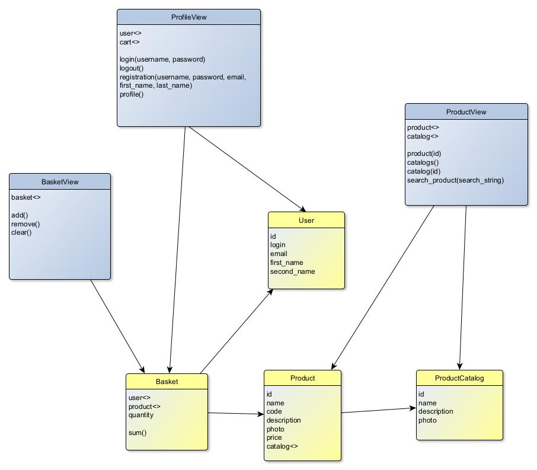

# UNI Plaza

документация по проекту от 05.2023

# Описание проекта

Uni Plaza – платформа для интернет-магазина, которая разрабатывается с учетом специфики определенной ниши товаров.

Одним из главных преимуществ Uni Plaza перед конкурентами является ее фокус на конкретной нише товаров. Это позволяет создать платформу, которая заточена под удовлетворение потребностей клиента и поддерживает функциональность, которую не предоставляют похожие платформы.

Основная целевая аудитория Uni Plaza – это владельцы небольших магазины или торговых сетей, которые планируют продавать товары в интернете для расширения своей клиентской базы, но не имеют достаточных знаний и ресурсов для создания собственного интернет-магазина.

Uni Plaza предоставляет заказчику функциональный интернет-магазин, реализованный на платформе за арендную плату. Это означает, что заказчик не обязан инвестировать значительные средства в создание и поддержку своего интернет-магазина. Вместо этого он может арендовать готовую платформу и начать продавать свои товары в интернете.

Uni Plaza предоставляет множество функций и возможностей, которые помогают магазинам управлять своими продажами и клиентами. Она предоставляет широкий набор инструментов для управления заказами, оплатой и доставкой товаров. Кроме того, Uni Plaza предоставляет интеграцию с различными платежными системами и доставкой товаров.

Также платформа  предоставляет магазинам возможность создания своего бренда и настройки дизайна своего интернет-магазина. Владельцы магазины могут выбирать из различных тем и шаблонов, чтобы создать уникальный дизайн своего интернет-магазина. Кроме того, Uni Plaza предоставляет возможность настройки SEO-оптимизации, что помогает привлекать больше посетителей на свой сайт.

Uni Plaza также предоставляет аналитические инструменты для отслеживания продаж и поведения клиентов. Это помогает владельцам понимать, какие товары наиболее популярны среди клиентов, и оптимизировать свой ассортимент товаров.

Платформа  разрабатывается с учетом всех современных требований безопасности и защиты данных. Она обеспечивает защиту личных данных клиентов и безопасность транзакций.

Платформа Uni Plaza предоставляет возможность управления своим интернет-магазином из любой точки мира. Она доступна через веб-интерфейс и может быть использована на любом устройстве с доступом в Интернет.

В целом, Uni Plaza – это идеальное решение для малых и средних предприятий, которые хотят начать продавать свои товары в интернете. Платформа предоставляет все необходимые инструменты и функции для управления интернет-магазином и обеспечивает приток  покупателей. Кроме того, Uni Plaza предоставляет заказчику возможность сэкономить деньги и время, арендуя готовую платформу вместо того, чтобы создавать свой собственный интернет-магазин.

# Технические требования
1. Разработка удобного и интуитивно понятного интерфейса для пользователей;
2. Совместимость с различными браузерами и устройствами;
3. Наличие функции поиска по сайту для быстрого и удобного поиска товаров;
4. Быстрый и безопасный процесс оформления заказа и оплаты; 
5. Наличие системы управления контентом для удобного добавления и редактирования товаров и категорий;
6. Интеграция с платежными системами и службами доставки;
7. Возможность создания акций и скидок на товары;
8. Наличие системы уведомлений о статусе заказа и его доставке;
9. Интеграция с системами лояльности и программами бонусов для повышения удовлетворенности клиентов; 
10. Аналитика и отчетность для мониторинга продаж и поведения пользователей на сайте;
11. Возможность добавления товаров в Избранное;
12. Поддержка системы подписки на новости и акции для уведомления пользователей о новых поступлениях и специальных предложениях; 
13. Поддержка SEO-оптимизации для повышения видимости сайта в поисковых системах; 
14. Ролевая система для разделения прав доступа для администраторов и менеджеров магазина;
15. Возможность оформления заказа без регистрации на сайте; 
16. Возможность создания персонального кабинета для пользователей с историей заказов и сохраненными данными;

# Архитектура приложения
Архитектура платформы интернет-магазина завязана на особенности технологического стека, а также реализуется на основе 
DDD. Domain-Driven Design - это подход к разработке программного обеспечения, который сосредоточен на моделировании 
бизнес-домена и его взаимодействии с пользователем. В DDD основное внимание уделяется разработке языка моделирования, 
который должен быть понятен как бизнес-экспертам, так и разработчикам. Основные принципы DDD включают в себя:
1. Фокус на бизнес-домене - модель должна отражать реальный бизнес-домен и его процессы.
2. Язык моделирования - модель должна быть выражена в языке, понятном для всех участников проекта.
3. Разделение на слои - приложение должно быть разделено на слои, каждый из которых отвечает за свои функции.
4. Использование агрегатов - объекты должны быть объединены в агрегаты, чтобы обеспечить целостность данных.
5. Применение контекстов - для каждого бизнес-процесса должен быть создан свой контекст, который определяет правила 
и ограничения.

DDD помогает разработчикам создавать более гибкие и масштабируемые приложения, которые лучше соответствуют потребностям
бизнеса.

### Объектная модель

# Роли и обязанности
1.	**_Product Owner (Владелец продукта)_**  
    отвечает за достижение максимальнои ценности продукта как результата работы, которую выполняет команда. 
2.	**_Backend-разработчик  _**
    отвечает за создание и поддержку backend-функциональности платформы интернет-магазина.
3.	**_Frontend-разработчик  _**
    отвечает за создание и поддержку frontend-функциональности платформы интернет-магазина.
4.	**_Бизнес-аналитик  _**
    отвечает за сбор, анализ и документирование требований, постановку задач разработчикам и написание технических заданий и другой проектно-аналитической документации. 
5.	**_Веб-дизайнер, UX/UI дизайнер;  _**
    отвечает за создание удобного и интуитивно понятного интерфейса продукта, исследование потребностей пользователей, проектирование пользовательских сценариев, создание прототипов и тестирование интерфейса.
	а также за создание визуальной составляющей продукта, включая цветовую гамму, шрифты, композицию и общий стиль.
6.	**_QA-инженер  _**
    отвечает за обеспечение качества платформы интернет-магазина.
7.	**_SEO-специалист  _**
    отвечает за оптимизацию сайта для поисковых систем, чтобы увеличить его посещаемость и продвижение в поисковых результатах.

# План разработки

Для реализация backend-части выбран технологический стек python django

# Бизнес-план

В стадии разработки
